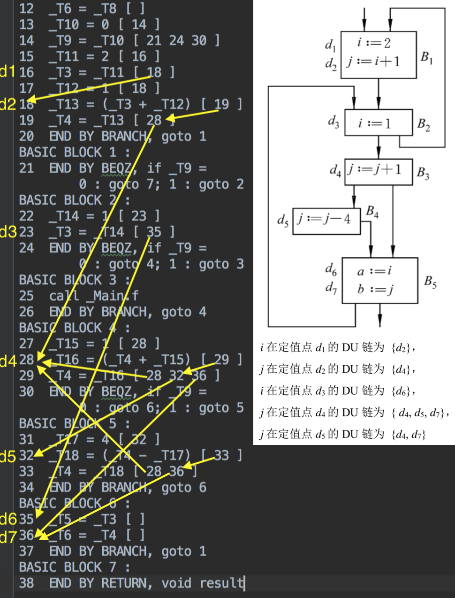

# Decaf PA4 实验报告

计53 王润基 2015011279

## 实验内容

在给定框架下，求解DU链。

## 实验过程

由于框架中已经实现了活性变量的求解，只需在求解Live的同时记录引用点的位置即可。

首先把BasicBlock类中`def` `liveUse` `liveIn` `liveOut`，以及Tac类中的`liveOut`的类型改为 `Map<Temp, Set<Integer>>`，修复编译错误。

在BasicBlock类中。首先定义`addLiveUse(Temp var, int pos)` `addDef(...)`函数，并代替`computeDefAndLiveUse()`中原有的调用。然后去掉所有addLiveUse下面的对lastVisitedBB的赋值操作，否则会导致前面use过的def不被识别。

在Tac类中，定义`addLiveOut(Temp var, int pos)`函数，并代替`BasicBlock.analyzeLiveness()`中原有的调用。最后从前往后扫描Tac，将liveOut的信息加入DUChain中。

在FlowGraph类中。定义`addLiveTo(Map<...> dst, Map<...> src) -> boolean changed`函数，并代替`analyzeLiveness()`中原有的`dst.allAll(src)`函数。

## 输出分析

​